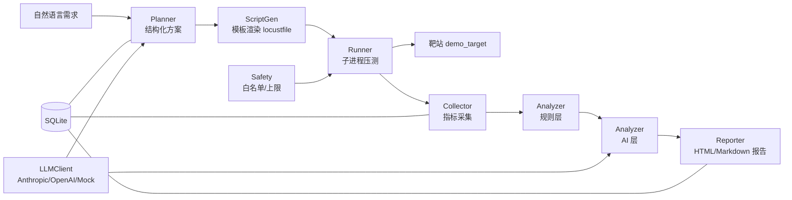

# AI 智能性能测试平台

从自然语言需求自动生成 Locust 压测脚本、执行压测、定位瓶颈并产出性能报告的开源平台。

```
自然语言需求 → AI 生成结构化测试方案 → 生成 Locust 脚本 → 自动压测
→ 指标采集 → 分析（规则 + AI）→ 瓶颈定位 → 性能报告（HTML + Markdown）
```

## 核心特性

- **结构化方案生成**：LLM 只产出结构化 `TestPlan`（Pydantic schema 校验 + 失败重试），
  不让 LLM 自由写代码。
- **模板渲染 + 静态校验**：Jinja2 渲染 locustfile，经 `ast` 语法校验、import 白名单、
  危险调用拦截、dry-run 三重防线。
- **规则先于 AI**：确定性规则层计算拐点/SLA/异常模式/资源相关性，AI 层只做解读，
  数字一致性校验器拦截 AI 编造数字。
- **内置靶站**：电商风格，6 种可注入性能故障（每种有标准答案），用于验证瓶颈定位。
- **压测机自监控**：psutil 采样压测机资源，避免"压测机成为瓶颈"导致结论失真。
- **无 Key 可跑**：MockLLM 保证无 API Key 时也能完整跑通 demo 和测试。

## 架构图



## 快速开始

### 方式一：Docker（推荐，一键启动平台 + 靶站）

```bash
docker compose up
```

启动后：
- 平台 Web UI：http://localhost:8000
- 靶站：http://localhost:8001

### 方式二：本机直接运行（无 Docker）

```bash
# 1. 创建虚拟环境并安装
python -m venv .venv
# Windows: .venv\Scripts\activate   Linux/macOS: source .venv/bin/activate
pip install -e ".[dev]"

# 2. 启动靶站（另一个终端）
python -m uvicorn demo_target.app:app --host 127.0.0.1 --port 8001

# 3. 启动平台（另一个终端）
python -m uvicorn app.main:app --host 127.0.0.1 --port 8000
```

浏览器打开 http://localhost:8000，输入需求即可。

### 方式三：CLI

```bash
# 生成方案
python -m app.cli plan "对登录和商品列表接口做负载测试" --output plan.json

# 执行压测 + 生成报告
python -m app.cli run plan.json --target http://127.0.0.1:8001 --output examples/reports
```

## 使用示例

在 Web UI 输入：

> 对登录、商品列表、商品详情接口做负载测试，最大 5 并发，P95 < 1000ms，错误率 < 5%

平台会：生成方案 → 你确认 → 触发压测 → 展示报告（含拐点、SLA、瓶颈分析、趋势图）。

## 内置靶站与故障注入

靶站暴露管理接口切换 6 种故障：

```bash
# 开启慢查询故障
curl -X POST http://localhost:8001/admin/faults \
  -H "Content-Type: application/json" \
  -d '{"name":"slow_query","enabled":true}'

# 查看资源指标
curl http://localhost:8001/metrics
```

| 故障 | 说明 | 标准答案 |
|------|------|---------|
| slow_query | 商品列表无索引全表扫描 | 慢查询 |
| n_plus_1 | 订单详情 N+1 查询 | N+1 |
| lock_contention | 下单全局锁竞争 | 锁竞争 |
| pool_exhaustion | 连接池过小 | 连接池耗尽 |
| memory_leak | 缓存无限增长 | 内存泄漏 |
| cpu_bound | CPU 密集计算 | CPU 密集 |

## 评测结果

对 6 种故障分别跑完整流程，验证瓶颈定位能力（详见 `docs/eval/`）：

| 指标 | 结果 |
|------|------|
| 问题方向识别准确率 | 66.7%（4/6） |
| 精确定位准确率 | 16.7%（1/6） |
| AI 定位（mock） | 0%（未启用真实 AI） |

**诚实结论**：规则层能识别"有无问题"和"大致方向"（延迟型识别较准），但精确定位
具体故障类型的能力有限（慢查询/N+1/连接池耗尽都表现为延迟上升，难以区分）。
memory_leak 和 cpu_bound 因评测时长太短未充分暴露。详见 `docs/eval/README.md`。

## 测试

```bash
pytest                        # 单元测试（LLM 相关用 MockLLM）
pytest tests/integration -v   # 集成测试（需靶站运行）
```

所有 LLM 相关测试默认用 MockLLM，不依赖网络和 API Key。

## 项目结构

```
ai-perf-platform/
├─ app/
│  ├─ api/            # FastAPI 路由
│  ├─ cli.py          # CLI（typer）
│  ├─ llm/            # LLMClient、provider、MockLLM、prompt
│  ├─ planner/        # 需求 → TestPlan
│  ├─ scriptgen/      # TestPlan → locustfile（模板 + 校验）
│  ├─ runner/         # 压测执行器
│  ├─ collector/      # 指标采集
│  ├─ analyzer/       # 规则分析 + AI 解读
│  ├─ reporter/       # 报告生成
│  └─ safety/         # 白名单、上限、确认
├─ demo_target/       # 内置靶站
├─ examples/          # 示例报告
├─ docs/              # design.md、resume.md、eval/
├─ tests/             # 单元 + 集成测试
└─ scripts/           # demo 与评测脚本
```

## 安全说明

- 默认只允许对 `localhost` 压测，显式授权域名需通过 `AP_ALLOWED_HOSTS` 配置。
- 并发/时长/RPS 有硬上限，超过需显式确认。
- **仅对你有授权的系统进行压测**，未经授权压测可能违法。

## 局限性与后续计划

- 拐点检测为简化启发式，短时测试可能误判。
- 规则层精确定位具体故障类型的能力有限（见评测）。
- 真实 AI 增量需在有 API Key 时另行评测。
- 后续：增强故障判别信号、增加稳定性测试场景、接入真实 LLM 对比评测。

## License

MIT
